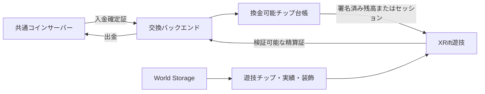
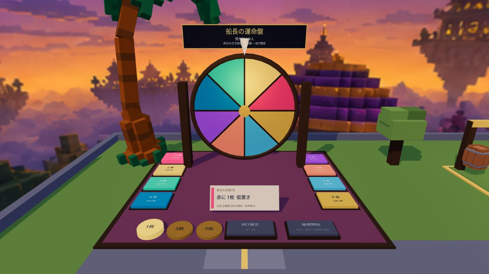
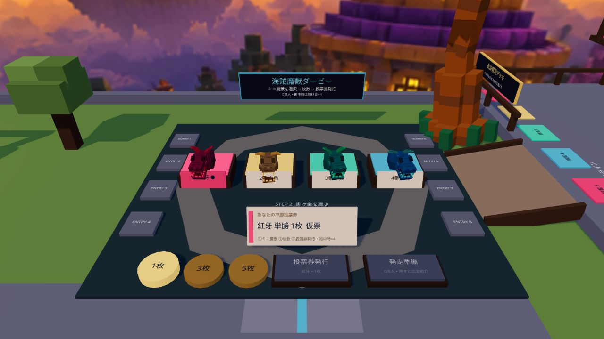

# Neon Casino Club 経済・交換所・4遊技UX計画 v24

作成日: 2026-08-16  
状態: 外部共通コイン仕様受領前の設計案。実装・公開は未着手。

## 結論

本線は「交換所で共通コインをカジノチップへ預け、遊技後に交換所でのみ戻す」方式とする。ただし、現在の `casino.coins.v1` はクライアントから更新できるワールド内残高であり、そのまま外部価値へ逆交換してはいけない。

残高を次の3層へ分ける。

1. **共通コイン**: 外部サーバーが正本。
2. **換金可能チップ**: 外部入金に裏付けられ、外部台帳または検証可能なセッション台帳が正本。
3. **遊技チップ**: 受付救済、実績、NPC戦、イベント配布。World Storageに保存できるが逆交換不可。

航海名声と実績は残高から独立させる。VIPは勝率や払戻優遇ではなく、遊技の幅、演出、観戦、テーマ、入場可能な高額卓で差を付ける。

## なぜ1対1逆交換が危険か

現行は残高0で受付から10枚を受け取れる。運命盤とダービーは理論上RTP100%で、麻雀・BJ・NPC戦にもワールド側から払戻を生成する経路がある。1カジノコインを1共通コインへ戻せると、救済配布やクライアント側残高操作が共通コインの発行口になる。

手数料だけでは防げない。必要なのは次の4点である。

- 換金可能残高と換金不可残高の分離
- 賭け金の出所を払戻まで引き継ぐ資金系統
- 外部サーバー側の冪等取引と台帳
- 交換差額、遊技場代、準備金による総量制御

## 推奨レート v0

最初のSandbox値として以下を採用候補にする。

| 項目 | 候補値 | 意図 |
| --- | ---: | --- |
| 入金 | 共通1 → 換金可能100チップ | 小額BETを整数化 |
| 入金手数料 | 0% | 遊び始めを重くしない |
| 出金 | 換金可能105チップ → 共通1 | 即時往復で約4.8%吸収 |
| 最小入金 | 共通1 | 初回導線を単純化 |
| レート見積期限 | 60秒 | 古いレートの再利用防止 |

日・週・月のユーザー別交換上限は設けない。残高以上を払わないこと、外部入金で裏付けられた準備金を超えて払わないことは上限ではなく台帳の支払能力条件として扱う。

平均RTP95%の遊技を1回通して全額を戻す単純モデルでは、共通コイン期待回収率は `0.95 / 1.05 = 90.5%`。ゲームの約5%場代と交換の約4.8%差額が主な吸収口になる。

## 資金系統

BET時に「遊技チップ優先」を既定にし、払戻の属性を賭け金の構成比で分ける。

- 遊技チップ10でBETし20戻る → 遊技チップ20
- 換金可能10でBETし20戻る → 換金可能20
- 遊技5 + 換金可能5でBETし20戻る → 遊技10 + 換金可能10

救済チップを賭けて換金可能チップへ洗い替える経路は作らない。

## 遊技レート案

### ブラックジャック

- 通常BET: 10 / 20 / 50チップ
- 通常勝ち: 総戻し2.0倍
- BJ: 総戻し2.5倍
- PUSH: 1.0倍
- 目標RTP: 約95%
- 2026-08-17の50万局簡易シミュレーションでは、17未満で引く戦略でRTP約94.8%、場側約5.2%

### 海賊じゃら

- ENTRY: 20チップ
- 2人以上の換金可能戦は人間の参加費プールから5%を控除し、勝者へ配分
- NPC補充分は遊技チップ賞金にだけ加算
- 1人プレイでは換金可能な利益をNPCから生成せず、上振れ分を遊技チップで付与

### 船長の運命盤

- BET: 10 / 20 / 50チップ
- 2人以上はパリミュチュエル方式。総プールの5%を控除し、的中者で比例配分
- 的中者0の場合は50%を次回ジャックポット、50%を吸収
- 1人モードは遊技チップ専用固定倍率。換金可能チップは使わない

### 海賊魔獣ダービー

- BET: 10 / 20 / 50チップ
- 2人以上は総プールの5%を控除する単勝パリミュチュエル
- 各魔獣の投票総額と暫定オッズを締切まで表示
- 1人モードは遊技チップ専用。NPC資金から換金可能利益を生成しない

## 共通コイン直接投入案

通常卓へ直接共通コインを送る方式は、刺激的だが初期実装にはしない。安全に成立させるには「航海金庫セッション」が必要になる。

1. 交換所で共通コイン1〜5をサーバー側エスクローへロック
2. `session_id`、期限、最大損失、使い切りnonceを受け取る
3. 赤い専用卓でのみプレイ
4. 終了または期限切れ時に交換所で一括精算

サーバー通信を毎ゲーム行わない場合、サーバーが検証できるラウンド証跡または事前発行チケットが必要である。クライアントが勝敗や残高を自己申告する方式は禁止する。

初期の直接投入対象は、参加者の賭け金だけで配当原資が閉じる運命盤・ダービーが適する。BJはデッキ秘匿とハウス準備金、海賊じゃらは行動履歴の検証が必要なため後段とする。

## 権限と台帳

World Storageは遊技チップ、実績、装飾、表示キャッシュに使う。換金可能チップの正本、二重支払防止、準備金計算には使わない。

## 交換所UX

浮遊画面ではなく、受付横の壁面台帳と卓上札を使う。

- 常時表示: `共通残高 / 総チップ / うち換金可能 / 遊技用`
- 入金札: 共通1 / 5 / 10
- 出金札: 共通1 / 3 / 5相当
- 見積札: 支払、受取、実質手数料、レート版、期限
- 確認札: 長押しまたは2段階確認
- 完了札: 取引ID、レート版、照会ボタン
- 障害表示: 再試行可能、処理中、取消済み、運営確認中を分離

色だけで区別せず、アイコン、名称、枠形状を併用する。共通コインは銀＋羅針盤、換金可能チップは金＋錨、遊技チップは紫＋旗とする。

## 4遊技UI/UX監査

### 1. ブラックジャック入口

- 強み: 4席、GM、卓の関係が一目で分かる。
- 問題: ENTRY料金、着席方法、ホスト権限が入口視点に出ていない。背後の運命盤が視線を奪う。
- 更新: 各椅子前に `空席 / ENTRY 20 / 座る`、卓手前に3ステップ案内を置く。

### 2. ブラックジャック着席

- 強み: 自分の手札、合計、1枚引く、止める、離席が同じ局所UIにまとまる。GM手札はGM上方の立面表示へ分離され、伏せ札の状態も読める。
- 問題: ボタンの優先度は色だけに頼らない補助記号がまだなく、背景遊技も近いため情報量は多い。
- 更新済み: 操作UIを23cm上げ、GM手札を卓面からGM上方へ移動。次回候補は主操作2択へのアイコン併記と、待機中の操作非表示。

### 3. 麻雀入口

- 強み: 四角卓と4席は理解しやすい。
- 問題: 麻雀と海賊じゃらのどちらを遊ぶ場所か分からず、入口から捨て牌・役・NPC補充が理解できない。
- 更新: 表記を海賊じゃらへ統一し、入口で `3枚組を集める / 1枚引いて1枚捨てる / 空席NPC` を図解する。

### 4. 麻雀着席

- 強み: 14牌、現在ターン、おすすめ、ツモ、離席が自席内にある。
- 問題: 牌が文字だけで小さく、同じ数字を識別しづらい。ポン・チー・ロンの期待を生むが実装されていない。
- 更新: 海賊クルー画像牌へ変更し、選択牌を1.25倍、捨てるボタンを明示。鳴きは実装するまで表示しない。

### 5. 運命盤

- 強み: 正面中央では盤、BET札、掛け金、確定、開始の順番が見える。
- 問題: 8色の端へ移動すると盤面視認が崩れる。文字が小さく、色覚差への代替記号がない。
- 更新: 8連アーク型キオスク、番号・色名・記号の三重表示、各位置から盤をFOV60で確認する。

### 6. ダービー投票

- 強み: ミニ魔獣、投票券、掛け金の順序が現行4遊技で最も明確。
- 問題: 中央投票券が2・3番台を隠し、灰色ENTRY枠が押せる場所に見える。誰へ賭けたかは色依存。
- 更新: 投票券を手前へ下げ、ENTRY枠を参加者表示専用と明記し、番号・名前・シルエットを併用する。

### 7. ダービー観覧

- 強み: 実際のユーザー確認ではSTART、GOAL、走行全体を十分追える。現行空間を維持する。
- 更新: 空間変更は行わず、5%場代、暫定オッズ、自分の投票先、確定着順の表示だけを追加候補とする。

## VIPとやり込み

VIPを2軸に分ける。ゲーム開放は航海名声と理解実績、接客上の華やかさは保有チップやワールド内消費で決める。

- 見習い: 受付とチュートリアル
- 船員: 4遊技を1回完了
- 航海士: 4遊技の理解実績、観戦実績、共同建設参加
- 船長: 航海士実績＋船長サロン入場券

別に `一般客 → 常連 → 上客 → 大船主` の船室グレードを置く。30日平均チップ残高または装飾・共同建設への累計消費で上げ、専用受付レーン、名前入り席札、個室卓、勝利花火、テーマ貸出、記念撮影を付ける。残高を減らした瞬間に格下げせず、30日単位で再計算する。

船長サロンは通常卓の5倍上限、専用実況、リプレイカメラ、テーマ卓、名前入り旗、定時大会を提供する。入場には航海士以上、リスク説明の確認、サロン券を要求する。RTP、勝率、交換レート、手数料は通常と同じにする。

実績は高額BETや連敗回数ではなく、異なる遊び方と理解を評価する。利益額ランキングは作らず、ゲーム別レベル、役図鑑、観戦記録、テーマ収集、共同建設貢献を表示する。

## 外部GitHub仕様を受け取ったら確認するもの

- XRiftユーザーと共通口座の結び方
- 残高、見積、入金、出金、取消、照会API
- 最小単位と小数精度
- 冪等キー、nonce、署名、レート版、有効期限
- エスクローまたは予約残高の有無
- 一括精算、ラウンド証跡、Webhookの有無
- CORS、許可ドメイン、レート制限
- Sandbox口座と失敗・再送例
- 外部コインの譲渡性、利用規約、運営上限

仕様受領後はAdapterを差し替え、まずモック、次にSandbox入金、最後に少額出金の順で検証する。

## 実装ゲート

1. 4遊技のUIUX修正をローカルで完了
2. 共通コインAdapterの型とモックを実装
3. 遊技チップと換金可能チップを別キー・別表示へ移行
4. Sandboxで二重送信、タイムアウト、再入場、期限切れを検証
5. 準備金、交換差額、ゲーム別RTPをダッシュボードで監視
6. 少額の入金のみ開始
7. 監査ログと突合が安定してから出金
8. 直接投入は別審査
